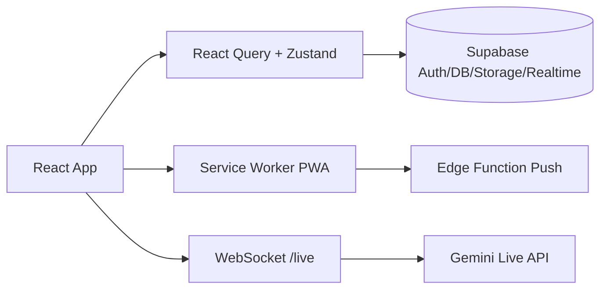
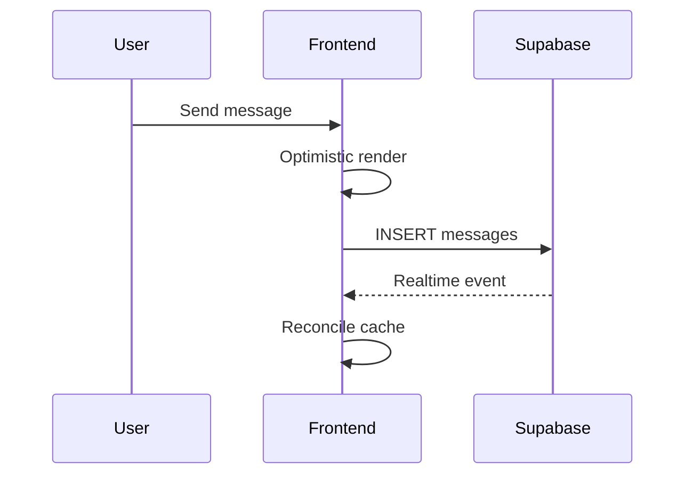
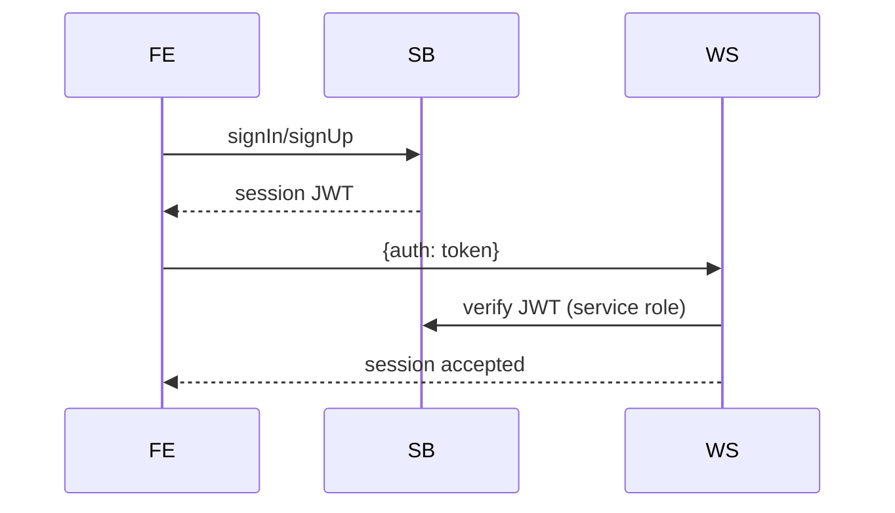
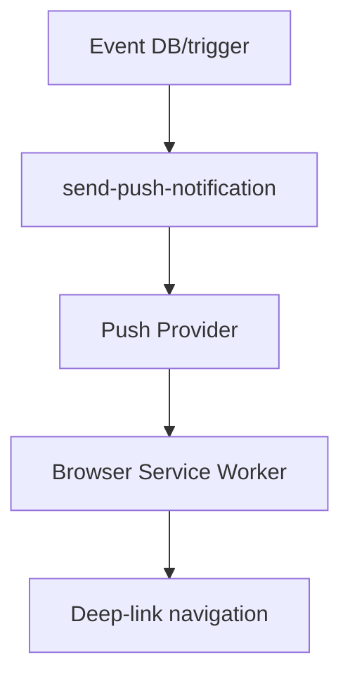

# NovaSnap — Documentation Produit & Architecture Technique (FR)

> **Slogan** : *Capture l’instant. Augmente la relation. Orchestration sociale en temps réel.*

NovaSnap est une plateforme **camera-first** mobile/web qui combine messagerie éphémère, stories, social graph, géolocalisation temps réel, PWA offline-ready et interfaces IA vocales. Là où Snapchat optimise une expérience fermée et mobile-native, NovaSnap explore une stratégie **web-native premium**, extensible et orientée rapidité d’itération produit.

---

## 1) Hero Section

### Positionnement
- **Produit** : réseau social visuel instantané, centré capture et conversation.
- **Technologie** : React 19 + Supabase + WebSocket Gemini + PWA production-grade.
- **Marché** : Gen Z / créateurs / social utility quotidien.

### Différenciation vs Snapchat
| Axe | Snapchat | NovaSnap |
|---|---|---|
| Distribution | App mobile fermée | PWA installable + web desktop simulé mobile |
| Vitesse d’itération | Dépend store mobile | Déploiement web continu |
| IA conversationnelle live | Partielle | Bridge WebSocket Gemini vocal natif |
| Stack backend | Propriétaire | Supabase + Edge Functions + SQL transparent |
| DevEx open source | Faible | Forte lisibilité architecture + migrations visibles |

---

## 2) Présentation Produit

### Problème résolu
Les applications sociales historiques séparent encore trop : caméra, chat, carte, stories, assistant IA. NovaSnap unifie ces parcours avec une navigation gestuelle transversale et une persistance de contexte.

### Philosophie
- **Camera-first** : caméra comme écran primaire.
- **Realtime-first** : présence, typing, messages, notifications.
- **Privacy-aware** : ghost mode, RLS, contrôles de visibilité.
- **AI-native** : orb vocal Gemini intégré à l’expérience sociale.

### Vision long terme
Construire la couche sociale augmentée : communication visuelle + contexte géospatial + copilot IA, avec un noyau temps réel scalable.

---

## 3) Fonctionnalités Utilisateur (UX + logique technique)

## Caméra & création
- Capture photo/vidéo, boomerang 2s, bascule avant/arrière, flash.
- Éditeur Snap : texte, dessin, stickers, crop, rotation, vitesse vidéo.
- Pipeline de flattening canvas avant envoi/sauvegarde.

**Flow UX**
1. Capture instantanée.
2. Édition non destructive locale.
3. Publication : chat, story ou memories.

**Contraintes & optimisations**
- Gestion blob/data URL locale.
- Contrôle taille/type média côté client.
- Signed URLs pour buckets privés.

## Chat & conversations
- 1:1 et groupes (jusqu’à 100 membres), réactions, mentions, statut de lecture.
- Messages éphémères + option de conservation.
- Typing indicator via broadcast/realtime.

**Temps réel**
- Subscription Supabase sur `messages`/`conversation_members`.
- Réordonnancement optimiste local + invalidation query.

## Stories
- Groupement par créateur, player segmenté, progression auto.
- Expiration temporelle, suppression propriétaire.
- Support visibilité (public/amis/privé selon migrations récentes).

## Snap Map & geolocation
- Leaflet, marqueurs amis, hotspots, stories géolocalisées.
- Ghost mode persistant local + propagation serveur via RPC heartbeat.
- Recherche lieux/amis + panneau de contrôle de visibilité.

## Présence
- Heartbeat toutes les 30s + trigger focus.
- Fonctions SQL dédiées statut online batch et proximité.

## Memories
- Galerie privée, filtres média, recherche, lightbox, édition légende.
- Sélection multiple et suppression en masse.

## PWA & notifications
- Service worker production : offline fallback, cache strategies, lifecycle updates.
- Push VAPID : abonnement, deep-link, actions notification, badge app.
- Prompts install / update / offline banner dédiés.

## IA (Gemini Orb)
- Session WebSocket authentifiée via JWT Supabase.
- Streaming audio (PCM) + texte temps réel.
- Bridge serveur Node entre client et Gemini Live.

---

## 4) Architecture Technique



### Data flow (chat)


### Auth flow


### Push flow


---

## 5) Stack Technique

| Domaine | Choix |
|---|---|
| Frontend | React 19, TypeScript, Vite 6, Tailwind v4 |
| State local | Zustand |
| Data fetching | TanStack Query |
| Backend app | Node/Express + ws |
| BaaS | Supabase (Auth, Postgres, Realtime, Storage) |
| AI | Gemini Live (`@google/genai`) |
| Realtime media/calls (prépa) | LiveKit deps présentes |
| PWA | Service Worker custom + manifest + badges/push |
| CI locale | `tsc --noEmit` |

---

## 6) Database

### Entités principales
`users`, `friendships`, `conversations`, `conversation_members`, `messages`, `message_status`, `stories`, `story_views`, `notification_tokens`.

### Relations
- N:N utilisateurs/conversations via `conversation_members`.
- 1:N conversations/messages.
- 1:N stories/views.

### Géospatial
- `users.last_location` en `geography(Point,4326)`.
- Index GiST et RPC proximité (`get_nearby_friends`).

### Realtime publication
- Publication Supabase sur tables de messagerie (migrations historiques + schéma).

### Storage
- Buckets : `avatars`, `stories`, `chats`, `temporary_snaps`.
- Politique signed URLs pour accès privé ; path legacy géré côté client.

---

## 7) Sécurité

### Contrôles actuels
- JWT Supabase pour session app + handshake websocket IA.
- RLS activé sur tables critiques.
- Politiques Storage durcies (migrations sécurité P0).
- Edge Functions admin/service-role séparées.
- Limites WS : timeout auth, taille payload, cap connexions/IP.

### Privacy-by-design
- Ghost mode (position masquée).
- Visibilité statut online configurable.
- Suppression compte Edge Function (cascade données + fichiers).

### Tradeoffs
- Supabase simplifie l’authN/authZ mais demande discipline forte des policies SQL.
- Signed URLs privées augmentent sécurité mais ajoutent latence d’accès média.

---

## 8) Performance

- React Query : cache, invalidations ciblées, `staleTime` par domaine.
- Optimistic UI sur chat pour perception instantanée.
- Lazy/dynamic loading (notamment Map/Leaflet).
- SW caches : network-first + SWR + fallback offline.
- Géospatial SQL indexé pour proximité scalable.
- Cache applicatif en mémoire pour signed avatar URLs.

### Défis
- Coût invalidations massives conversationnelles à forte volumétrie.
- Render heavy dans écrans multiplex (chat/story/map) sur mobile bas de gamme.

---

## 9) Système Realtime

| Sous-système | Mécanisme |
|---|---|
| Chat temps réel | Supabase Realtime `postgres_changes` |
| Typing | Broadcast / états transitoires |
| Présence | RPC heartbeat + calcul online status |
| Notifications | Edge Function push + SW listeners |
| IA live | WebSocket dédié /live |

---

## 10) IA

### Architecture Gemini Live
- Frontend capte audio PCM (worklet `pcm-capture-processor.js`).
- WS sécurisé envoie frames audio/vidéo.
- Serveur `gemini-ws-server.ts` relaie flux bidirectionnel.
- Orb UI affiche état connexion / streaming.

### Contraintes IA
- Latence réseau impacte naturel conversationnel.
- Coût token/stream à monitorer (rate limit + quotas).
- Nécessité de filtrage/modération en sortie pour scale public.

---

## 11) PWA

- `manifest.json`: icônes, shortcuts, installabilité.
- `sw.js`: caching offline + push interaction + navigation.
- Composants UX dédiés : `InstallPrompt`, `UpdatePrompt`, `OfflineBanner`.

### Mobile constraints
- iOS PWA limitations (background push/quotas variables).
- Storage cache navigateur dépendant du device et pression mémoire.

---

## 12) Developer Experience

### Structure
- `src/screens`: flux produit.
- `src/hooks`: accès data + logique query.
- `src/components`: UI reusable / feature components.
- `src/store`: état global transversal.

### Patterns
- Séparation état serveur (Query) vs état UI/app (Zustand).
- Types partagés centralisés (`src/lib/types.ts`).
- Helpers média robustes (`getValidMediaUrl`).

---

## 13) Installation

```bash
npm install
cp .env.example .env
npm run dev
```

### Prérequis
- Node 18+
- Projet Supabase
- Clé Gemini
- Clés VAPID

### Build & run
```bash
npm run build
npm start
npm run lint
```

---

## 14) Variables d’environnement

| Variable | Scope | Description |
|---|---|---|
| `VITE_SUPABASE_URL` | client | URL projet Supabase |
| `VITE_SUPABASE_ANON_KEY` | client | clé anon publique |
| `SUPABASE_SERVICE_ROLE_KEY` | serveur | admin key, jamais client |
| `GEMINI_API_KEY` | serveur | accès Gemini Live |
| `GEMINI_LIVE_MODEL` | serveur | modèle audio live |
| `GEMINI_VOICE_NAME` | serveur | voice persona |
| `VITE_VAPID_PUBLIC_KEY` | client | push subscribe |
| `APP_URL` | serveur/client config | URL racine app |
| `VITE_LIVEKIT_URL` | client | endpoint LiveKit |
| `VITE_LIVEKIT_API_KEY` | client | clé publique LiveKit |
| `LIVEKIT_API_SECRET` | serveur | secret LiveKit |

---

## 15) Deployment

### Frontend
- Build Vite statique.
- Serve via Express (prod) ou CDN front.

### Backend WS
- Déployer `dist/server.cjs` avec variables serveur.
- Protéger endpoint `/live` par TLS + limites réseau.

### Supabase
- Appliquer migrations SQL.
- Déployer Edge Functions (`send-push-notification`, `delete-account`, `check-rate-limit`, `security-dashboard`).

---

## 16) Scalabilité

- **DB** : indexation ciblée (temps + géospatial), partition future messages.
- **Realtime** : séparation canaux par conversation et throttling présence.
- **WebSocket IA** : pool/quotas et autoscaling horizontal.
- **Storage** : CDN + transcodage async vidéo.

### Why this architecture
BaaS + hooks typed + websocket ciblé permet d’expédier vite sans sacrifier sécurité de base ni évolutivité.

---

## 17) Observabilité

### Recommandations
- Logs structurés front/server/edge.
- Sentry (frontend + Node + Deno edge).
- Metrics clés : latence chat realtime, succès push, auth WS failures, coût IA/minute.
- Alerting : spikes 401/403, échecs storage signing, timeouts websocket.

---

## 18) Accessibilité

- Contrastes thèmes dark/light à auditer WCAG AA.
- Navigation clavier desktop mode (focus states).
- Alternatives textuelles médias critiques.
- Gestures : prévoir fallback boutons explicites.

---

## 19) Product Vision (Apple/Meta-style)

NovaSnap doit devenir l’OS social de la communication visuelle : un espace où capture, présence, contexte spatial et intelligence artificielle se combinent dans un seul graphe d’interactions, intime, temps réel et portable.

---

## 20) Future Improvements, Tradeoffs, Operational Concerns

### Future improvements prioritaires
1. E2E encryption messages sensibles.
2. Queue média (compression/transcoding).
3. Shadow traffic tests pour canaux realtime.
4. Modération IA hybride (auto + humaine).
5. Contract tests SQL/RLS en CI.

### Operational concerns
- Dérive coûts IA et push à grande échelle.
- Drift des policies RLS au fil des migrations.
- Robustesse offline lors reconnection multi-events.

### Architecture decisions à documenter en ADR
- Raison d’usage Supabase Realtime vs broker dédié.
- Modèle de permissions stories (public/friends/private).
- Stratégie conservation éphémère et rétention légale.

---

## Conclusion

NovaSnap possède déjà une base produit/tech remarquable : UX mobile premium, realtime fonctionnel, socle sécurité en progression active et intégration IA différenciante. La prochaine étape est claire : industrialiser l’observabilité, renforcer la sécurité de bout en bout et scaler les flux temps réel pour une ambition grand public internationale.
